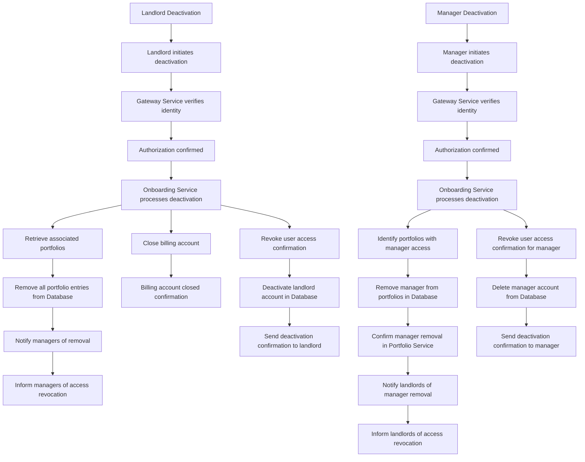

```mermaid
flowchart TD
    A[Landlord Deactivation] --> B[Landlord initiates deactivation]
    B --> C[Gateway Service verifies identity]
    C --> D[Authorization confirmed]
    D --> E[Onboarding Service processes deactivation]
    E --> F[Retrieve associated portfolios]
    F --> G[Remove all portfolio entries from Database]
    G --> H[Notify managers of removal]
    H --> I[Inform managers of access revocation]
    E --> J[Close billing account]
    J --> K[Billing account closed confirmation]
    E --> L[Revoke user access confirmation]
    L --> M[Deactivate landlord account in Database]
    M --> N[Send deactivation confirmation to landlord]

    A2[Manager Deactivation] --> B2[Manager initiates deactivation]
    B2 --> C2[Gateway Service verifies identity]
    C2 --> D2[Authorization confirmed]
    D2 --> E2[Onboarding Service processes deactivation]
    E2 --> F2[Identify portfolios with manager access]
    F2 --> G2[Remove manager from portfolios in Database]
    G2 --> H2[Confirm manager removal in Portfolio Service]
    H2 --> I2[Notify landlords of manager removal]
    I2 --> J2[Inform landlords of access revocation]
    E2 --> K2[Revoke user access confirmation for manager]
    K2 --> L2[Delete manager account from Database]
    L2 --> M2[Send deactivation confirmation to manager]
```