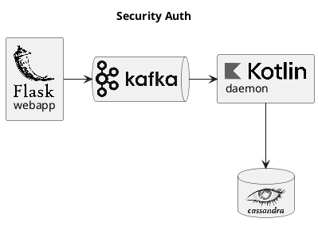

```plantuml
@startuml
!include <logos/flask>
!include <logos/kafka>
!include <logos/kotlin>
!include <logos/cassandra>

title Security Auth

rectangle "<$flask>\nwebapp" as webapp
queue "<$kafka>" as kafka
rectangle "<$kotlin>\ndaemon" as daemon
database "<$cassandra>" as cassandra

webapp -> kafka
kafka -> daemon
daemon --> cassandra
```